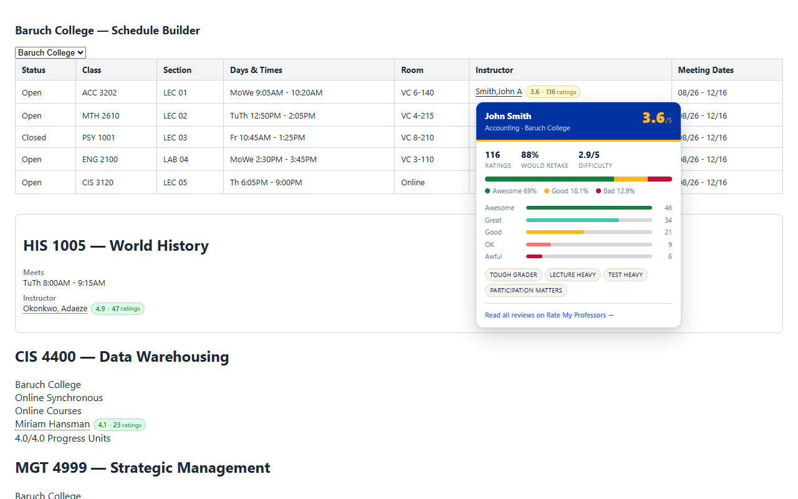

# RMP for CUNYfirst Schedule Builder

**See professor ratings while you pick your classes — not after.**

Registration shouldn't mean twenty tabs. This extension puts Rate My Professors
data right where you're already looking: inside CUNYfirst and Schedule Builder,
next to every instructor name.

## What you get

**A rating on every name.** Instructor names pick up a colour-coded badge —
green, yellow, red — with the number of ratings spelled out, so a 4.8 from three
students never looks like a 4.8 from three hundred.

**The full picture on hover.** Hold over any name for the score breakdown:
would-take-again, average difficulty, the Awesome / Good / Bad split, the whole
5-to-1 histogram, and the tags students actually attached to their reviews —
*Tough grader*, *Test heavy*, *Amazing lectures*.

**One click to the profile.** Every name becomes a link straight to that
professor's RMP page. No profile found? It links to a search for the name instead.

**It knows your campus.** All 26 CUNY colleges are recognised, read straight off
the page. If a page doesn't say which college it belongs to, the extension tells
you it guessed rather than pretending it knows — and you can pin your campus in
one click.

**It stays out of the way.** `Staff`, `TBA` and unassigned sections are left
alone. Your page is never rewritten — turn the extension off and it's exactly as
it was.

## Install

Available for **Chrome**, **Edge**, **Firefox** and **Safari**.

> Chrome Web Store listing coming shortly — this README will link to it.

## Your data stays yours

There is no account, no analytics, no tracking, and no server of ours for
anything to be sent to.

The only thing that ever leaves your browser is an instructor's name, sent to
Rate My Professors to look up their public rating — the same request you'd make
by searching that name yourself. It's sent without cookies, so it can't be tied
back to you. Ratings are cached locally so the same page doesn't re-query, and
uninstalling deletes all of it.

Full details: [PRIVACY.md](PRIVACY.md).

## A note on the ratings themselves

Rate My Professors reviews are user-submitted opinions from a self-selected
group of students. People who felt strongly are more likely to have posted.
Treat them as one signal among several, not as fact.

## Disclaimer

Not affiliated with, endorsed by, or connected to CUNY or Rate My Professors.
All trademarks belong to their respective owners.

## License

MIT — see [LICENSE](LICENSE).
