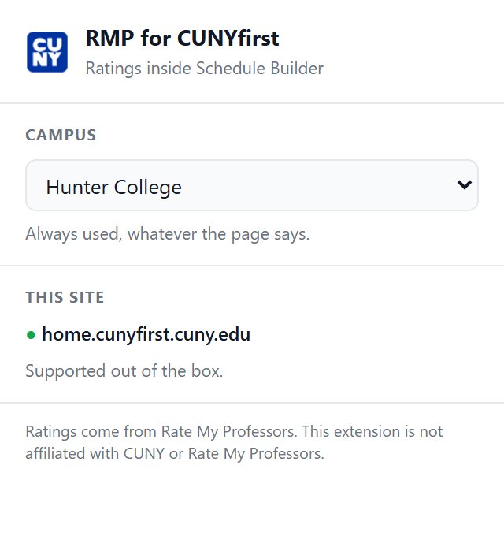

# RMP for CUNYfirst Schedule Builder

A browser extension that pulls Rate My Professors data into CUNYfirst so you can
judge a section without opening a second tab. Every instructor name becomes a
link to their RMP profile, picks up an inline rating badge, and shows a full
score breakdown on hover.

## What it does

- **Inline rating badge** next to every instructor name, colour-coded green /
  yellow / red, with the rating count spelled out behind it.
- **The name becomes a link** straight to that professor's RMP profile. When
  nobody matches, it links to an RMP search for the name instead.
- **Hover preview** showing the headline score, would-take-again percentage,
  average difficulty, the Awesome / Good / Bad split, the full 5-to-1
  histogram, and the professor's most common tags.

## Supported pages

| Site | URL |
| --- | --- |
| Anything on CUNY | `https://*.cuny.edu/*` |
| College Scheduler | `https://*.collegescheduler.com/*` |

That covers CUNYfirst, Schedule Builder and Global Class Search wherever your
campus serves them from — the Schedule Builder subdomain is not the same
everywhere, and an extension that silently never injects is the worst failure
mode there is. The scanner is conservative, so on CUNY pages with no class
listings it simply finds nothing and does nothing.

**If your Schedule Builder lives somewhere else entirely**, open the popup on
that page and use **This site → Turn on for this site**. That asks Chrome for
permission to that one origin and registers the content scripts there, no code
change or reinstall needed. The same button turns it back off and revokes the
permission.

All 26 CUNY campuses are recognised. The campus is detected from the page —
institution dropdown, page title, header branding, URL — and falls back to
Baruch if none of those say.

## Install

The extension is unpacked-only — it is not in any extension store. It runs on
Chrome, Firefox and Safari from one source tree; only the manifest differs, and
`npm run build` generates all three.

### Chrome / Edge

1. Clone this repo.
2. Open `chrome://extensions` (or `edge://extensions`).
3. Turn on **Developer mode**.
4. Click **Load unpacked** and pick the repo folder.
5. Open Schedule Builder and search for classes.

The repo root *is* the Chrome extension, so there is no build step for it.

### Firefox

Needs **Firefox 128 or newer**. Earlier releases either do not grant Manifest V3
host permissions at install (before 127) or do not understand
`optional_host_permissions` (before 128), and the extension installs but never
reaches Rate My Professors.

```bash
npm run build          # writes dist/firefox
```

1. Open `about:debugging#/runtime/this-firefox`.
2. Click **Load Temporary Add-on…**
3. Pick `dist/firefox/manifest.json`.

Temporary add-ons are cleared when Firefox closes. For a permanent install the
add-on has to be signed through [addons.mozilla.org](https://addons.mozilla.org).

### Safari

Needs **macOS with Xcode** — Safari cannot load an unpacked extension the way
Chrome and Firefox can, so it has to be wrapped in a native app first.

```bash
npm run build          # writes dist/safari
xcrun safari-web-extension-converter dist/safari \
  --app-name "RMP for CUNYfirst" \
  --bundle-identifier com.example.rmp-cunyfirst
```

That generates an Xcode project. Build and run it, then enable the extension in
**Safari → Settings → Extensions**. Safari does not show host permissions at
install: open a Schedule Builder page, click the extension in the toolbar and
choose **Always Allow on This Website**, or nothing will be annotated.

No bundler, no transpiler and no `npm install` is required to run any of the
three — the build script only copies files and writes a manifest. Dependencies
are needed for the browser-based tests.

### Packaging for a store

Upload `dist/<browser>`, **not** the repo root — the root carries `test/`,
`tools/`, `docs/` and `node_modules`, none of which belong in a shipped
extension. `dist/chrome` is the same extension at 22 files.

```bash
npm run build
cd dist/chrome && zip -r ../rmp-cunyfirst-chrome.zip .          # macOS / Linux
```

```powershell
npm run build
Compress-Archive dist\chrome\* dist\rmp-cunyfirst-chrome.zip -Force   # Windows
```

`manifest.json` has to sit at the **top level** of the archive. Note the `\*` —
zipping the folder itself nests everything one level down and every browser
then rejects it as having no manifest.

Permissions, and what each is actually for, if a reviewer asks:

| Permission | Why |
| --- | --- |
| `storage` | The rating cache, in `chrome.storage.local`. Nothing leaves the browser. |
| `scripting` | Registers content scripts on a site the user opts in to. |
| `activeTab` | Reads the current tab's origin when the popup opens, to offer that opt-in. |
| `host_permissions` | `ratemyprofessors.com` to fetch ratings; the two campus domains to annotate them. |
| `optional_host_permissions` | Not granted at install. Backs the "Turn on for this site" button, one origin per grant. |

## How it works

```
CUNYfirst page
   │
   ├─ scanner.js      finds instructor names in the DOM
   ├─ name-utils.js   "Smith,John A"  ->  { first: John, last: Smith }
   ├─ badge.js        wraps the name in a link, injects the badge
   ├─ hovercard.js    renders the preview card
   │
   └─ chrome.runtime.sendMessage
          │
          ▼
   background (service worker on Chrome, event page on Firefox/Safari)
   ├─ schools.js      campus  ->  RMP school id (resolved live, then cached)
   ├─ rmp-client.js   GraphQL search + profile detail
   ├─ matching.js     scores candidates, rejects anything below the bar
   ├─ origins.js      which sites may be injected into, and which never may
   └─ cache.js        TTL cache in chrome.storage.local
```

A few decisions worth knowing about:

**The scanner does not rely on fixed selectors.** CUNY runs at least two very
different UIs and each campus skins them differently, so it tries three
strategies in order: explicit instructor markup (`class`/`data-testid`/
PeopleSoft ids), the column under an `Instructor` table header, and text
following an `Instructor:` label.

**Names are never rewritten.** The annotator splits the existing text node with
`splitText()` and re-parents it inside an anchor, so the node the host app holds
a reference to still exists. Nothing is injected with `innerHTML` — a test
enforces that.

**A wrong rating is worse than no rating.** RMP's search is fuzzy and a surname
query routinely returns a dozen people, so every candidate is scored on surname,
given name (including nicknames and initials), middle initial and department.
Anything below the acceptance threshold shows `n/a` rather than a guess. Where
two different professors score within a hair of each other the badge is marked
ambiguous and the hover card says so explicitly.

**Requests are cached and paced.** Lookups are cached for 7 days, misses for 1
day, and identical in-flight requests are de-duplicated, so a results page with
40 instructors makes at most 40 requests once and none on the next visit.
Outbound requests are capped at 3 concurrent with a minimum gap between them.

## Settings



Two, and deliberately only two. Ratings and the hover preview are always on, and
the card always shows difficulty and would-take-again — those are behaviour, not
preferences. The popup carries the two things that genuinely cannot be defaults:

- **Campus** — detection reads the college off the page, but plenty of pages
  never name it, and the fallback is a guess. A wrong guess is worse than no
  guess here: it returns a real professor with a real rating from the wrong
  college. Pick your campus and it is used regardless of what the page says.
- **This site** — turn the extension on for a Schedule Builder the manifest does
  not already cover. Needs a host permission, and browsers only grant those from
  a click.

Changing campus takes effect immediately on any page already open; every badge
is cleared and re-resolved against the new college.

## Privacy

- The only host contacted is `ratemyprofessors.com`, and only to look up the
  names already displayed on the page you are viewing.
- The broad `https://*/*` entry is an **optional** permission — no browser
  grants it at install time. It exists solely so the "Turn on for this site"
  button has something to request, and each use grants exactly one origin.
- `ratemyprofessors.com` is a host permission so the background can fetch from
  it. The content scripts never run there, so RMP's own pages are left alone.
- No analytics, no telemetry, no third-party servers, no accounts.
- Requests are sent with `credentials: 'omit'`, so no cookies go with them.
- Everything cached (ratings, resolved school ids) stays in local browser
  storage.

## Development

```bash
npm test              # unit tests -- no dependencies, uses node:test
npm run test:dom      # DOM tests in real Chromium (needs playwright)
npm run test:dom -- --shots   # ...and write screenshots to test/screenshots
npm run build         # write dist/chrome, dist/firefox, dist/safari
npm run build firefox # ...or just one
npm run icons         # regenerate the PNG icons

npx web-ext lint --source-dir dist/firefox    # Mozilla's validator (optional)
```

The unit suite covers name parsing, match scoring, campus detection, subject
mapping, origin classification and API response shaping, plus structural checks
run against **all three manifests** (every referenced file exists, scripts are
in dependency order, host permissions cover every injected origin, no content
script targets RMP itself, all JS parses).

`test/dom.integration.js` drives the content scripts against
`test/fixtures/schedule-builder.html` in headless Chromium with the messaging
layer stubbed, asserting that names are found, links and badges are correct,
co-taught cells split into two links, the hover card renders the right
distribution, and teardown restores the page byte for byte.

```
manifest.json     the Chrome manifest (hand-maintained; a test keeps it in step)
src/lib/          shared code (content scripts, background, and the tests)
src/background/   the only place that talks to RMP
src/content/      scanner, annotator, hover card, styles
src/popup/        toolbar popup -- per-site opt-in, nothing else
tools/            manifest generator, build script, PNG icon generator
test/             unit tests + browser integration test
dist/             per-browser bundles (generated, not committed)
```

Every file is a classic script that hangs its exports off a single `RMPX`
global. That is what lets the same source run as a content script, as a Chrome
service worker, as a Firefox/Safari event page, and under `node --test`, with
no bundler anywhere.

### What differs between browsers

Only the manifest, which is why it is generated from one base in
`tools/manifests.js` rather than kept as three files that drift.

| | Chrome | Firefox | Safari |
| --- | --- | --- | --- |
| Background | service worker | event page | event page |
| Loads libraries via | `importScripts()` | manifest | manifest |
| Host permissions | granted at install | granted at install (127+) | granted per site, at time of use |
| Install | Load unpacked | `about:debugging` | Xcode wrapper |

Firefox has no service worker in Manifest V3 at all, so the background runs as
an event page there — where `importScripts` does not exist and the manifest has
to preload the libraries itself. Safari supports both; it gets the event page
too, so there is one fewer environment to differ. The background script guards
its `importScripts` call and works either way, and a test asserts the two lists
cannot fall out of step.

## Troubleshooting

**No badges appear anywhere.** Open the page, press F12, and look in the
Console for a line starting `[RMP for CUNYfirst]`.

- *The line is there* — the extension is injected and running, but this page
  presents instructors in markup the scanner does not recognise yet. The line
  reports which strategies fired and how many hits each got. Grab the
  surrounding HTML with the snippet below and open an issue.
- *The line is not there, and there are no badges* — the content script is not
  being injected at all, meaning the page's URL is not covered. Open the popup
  and use **This site → Turn on for this site**, then reload the page.

To confirm injection directly: switch the Console's context dropdown (it reads
`top` by default) to **RMP for CUNYfirst** and type `RMPX`. An object means
injected, `undefined` means not.

To dump the markup around an instructor, run this in the Console with a real
surname from the page substituted in:

```js
[...document.querySelectorAll('*')]
  .filter(e => !e.children.length && /Hansman/.test(e.textContent))
  .map(e => e.parentElement.parentElement.outerHTML)
  .join('\n\n---\n\n')
```

**Badges all read `n/a`.** Names are being found but nothing is matching on
RMP. Open the service worker console (`chrome://extensions` → this extension →
*service worker*) and look for GraphQL errors; that usually means the
unofficial API changed shape and `src/lib/rmp-client.js` needs updating.

## Known limitations

- **The Rate My Professors API is unofficial and undocumented.** It can change
  without notice. Every response is defensively unwrapped and any structural
  surprise degrades to "no data" rather than breaking the page, but a schema
  change will need a fix here. If badges suddenly all read `n/a`, that is the
  first thing to check.
- **Matching is heuristic.** Adjunct professors and instructors new to a campus
  frequently have no RMP profile at all. Common names are the hard case; the
  ambiguity warning exists because it is not always possible to be sure.
- **Schedule Builder markup varies by campus.** The three scanning strategies
  cover the layouts tested here, but a campus with unusual markup may need a
  selector added to `EXPLICIT_SELECTORS` in `src/content/scanner.js`.
- **Chromium only, as written.** Firefox needs a `browser_specific_settings`
  block and an `importScripts` shim, since Firefox MV3 uses event pages.

## Disclaimer

Not affiliated with, endorsed by, or connected to CUNY or Rate My Professors.
Ratings are user-submitted opinions from a self-selected group of students —
treat them as one signal among several, not as fact.

## License

MIT — see [LICENSE](LICENSE).
