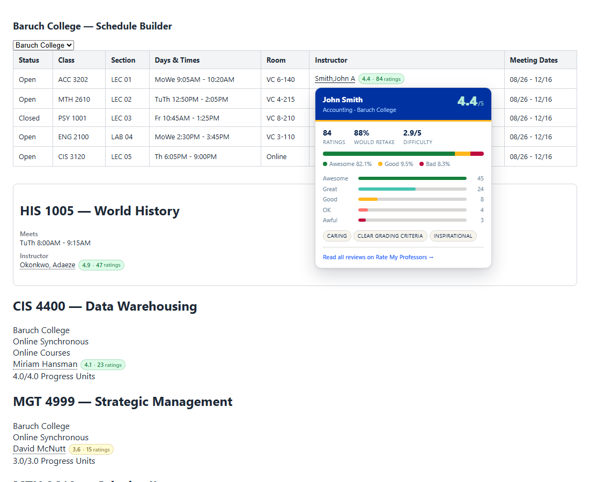

# RMP for CUNYfirst Schedule Builder

A browser extension that pulls Rate My Professors data into CUNYfirst so you can
judge a section without opening a second tab. Every instructor name becomes a
link to their RMP profile, picks up an inline rating badge, and shows a full
score breakdown on hover.



## What it does

- **Inline rating badge** next to every instructor name, colour-coded green /
  amber / red, with the number of ratings behind it.
- **The name becomes a link** straight to that professor's RMP profile. When
  nobody matches, it links to an RMP search for the name instead.
- **Hover preview** showing the headline score, would-take-again percentage,
  average difficulty, the Awesome / Good / Bad split, the full 5-to-1
  histogram, and the professor's most common tags.
- **Leaves the page alone otherwise.** `Staff`, `TBA` and other placeholders are
  skipped, and the original text is never rewritten — turning the extension off
  restores the page exactly.

## Supported pages

| Site | URL |
| --- | --- |
| Anything on CUNY | `https://*.cuny.edu/*` |
| College Scheduler | `https://*.collegescheduler.com/*` |

That covers CUNYfirst, Schedule Builder and Global Class Search wherever your
campus serves them from — the Schedule Builder subdomain is not the same
everywhere, and an extension that silently never injects is the worst failure
mode there is. The scanner is conservative, so on CUNY pages with no class
listings it simply finds nothing and does nothing.

**If your Schedule Builder lives somewhere else entirely**, open the popup on
that page and use **This site → Turn on for this site**. That asks Chrome for
permission to that one origin and registers the content scripts there, no code
change or reinstall needed. The same button turns it back off and revokes the
permission.

All 25 CUNY campuses are recognised. The campus is detected from the page
(institution dropdown, page title, header branding, URL) and can be pinned
manually from the popup.

## Install

The extension is unpacked-only — it is not on the Chrome Web Store.

1. Clone this repo.
2. Open `chrome://extensions` (or `edge://extensions`).
3. Turn on **Developer mode**.
4. Click **Load unpacked** and pick the repo folder.
5. Open Schedule Builder and search for classes.

No build step. There is no bundler and no `npm install` required to run it —
dependencies are only needed for the browser-based tests.

## How it works

```
CUNYfirst page
   │
   ├─ scanner.js      finds instructor names in the DOM
   ├─ name-utils.js   "Smith,John A"  ->  { first: John, last: Smith }
   ├─ badge.js        wraps the name in a link, injects the badge
   ├─ hovercard.js    renders the preview card
   │
   └─ chrome.runtime.sendMessage
          │
          ▼
   service-worker.js
   ├─ schools.js      campus  ->  RMP school id (resolved live, then cached)
   ├─ rmp-client.js   GraphQL search + profile detail
   ├─ matching.js     scores candidates, rejects anything below the bar
   └─ cache.js        TTL cache in chrome.storage.local
```

A few decisions worth knowing about:

**The scanner does not rely on fixed selectors.** CUNY runs at least two very
different UIs and each campus skins them differently, so it tries three
strategies in order: explicit instructor markup (`class`/`data-testid`/
PeopleSoft ids), the column under an `Instructor` table header, and text
following an `Instructor:` label.

**Names are never rewritten.** The annotator splits the existing text node with
`splitText()` and re-parents it inside an anchor, so the node the host app holds
a reference to still exists. Nothing is injected with `innerHTML` — a test
enforces that.

**A wrong rating is worse than no rating.** RMP's search is fuzzy and a surname
query routinely returns a dozen people, so every candidate is scored on surname,
given name (including nicknames and initials), middle initial and department.
Anything below the acceptance threshold shows `n/a` rather than a guess. Where
two different professors score within a hair of each other the badge is marked
ambiguous and the hover card says so explicitly.

**Requests are cached and paced.** Lookups are cached for 7 days, misses for 1
day, and identical in-flight requests are de-duplicated, so a results page with
40 instructors makes at most 40 requests once and none on the next visit.
Outbound requests are capped at 3 concurrent with a minimum gap between them.

## Settings


Click the toolbar icon:

- **Show ratings** — master switch.
- **Hover preview** — turn the card off and keep just badges and links.
- **Campus** — auto-detect, or pin a specific college.
- **Hover card details** — show or hide difficulty and would-take-again.
- **Cache** — see how many professors are cached and clear them.

## Privacy

- The only host contacted is `ratemyprofessors.com`, and only to look up the
  names already displayed on the page you are viewing.
- The broad `https://*/*` entry is an **optional** permission — Chrome does not
  grant it at install time. It exists solely so the "Turn on for this site"
  button has something to request, and each use grants exactly one origin.
- No analytics, no telemetry, no third-party servers, no accounts.
- Requests are sent with `credentials: 'omit'`, so no cookies go with them.
- Everything cached (ratings, resolved school ids, your settings) stays in local
  browser storage.

## Development

```bash
npm test              # unit tests -- no dependencies, uses node:test
npm run test:dom      # DOM tests in real Chromium (needs playwright)
npm run test:dom -- --shots   # ...and write screenshots to test/screenshots
npm run icons         # regenerate the PNG icons
```

The unit suite covers name parsing, match scoring, campus detection, subject
mapping and API response shaping, plus structural checks on `manifest.json`
(every referenced file exists, content scripts are in dependency order, host
permissions cover every injected origin, all JS parses).

`test/dom.integration.js` drives the content scripts against
`test/fixtures/schedule-builder.html` in headless Chromium with the messaging
layer stubbed, asserting that names are found, links and badges are correct,
co-taught cells split into two links, the hover card renders the right
distribution, and teardown restores the page byte for byte.

```
manifest.json
src/lib/          shared code (loaded as content scripts, via importScripts, and by tests)
src/background/   MV3 service worker -- the only place that talks to RMP
src/content/      scanner, annotator, hover card, styles
src/popup/        settings UI
tools/            dependency-free PNG icon generator
test/             unit tests + browser integration test
```

Every file is a classic script that hangs its exports off a single `RMPX`
global, which is what lets the same source run as a content script, inside the
service worker, and under `node --test` with no build step.

## Troubleshooting

**No badges appear anywhere.** Open the page, press F12, and look in the
Console for a line starting `[RMP for CUNYfirst]`.

- *The line is there* — the extension is injected and running, but this page
  presents instructors in markup the scanner does not recognise yet. The line
  reports which strategies fired and how many hits each got. Grab the
  surrounding HTML with the snippet below and open an issue.
- *The line is not there, and there are no badges* — the content script is not
  being injected at all, meaning the page's URL is not covered. Open the popup
  and use **This site → Turn on for this site**, then reload the page.

To confirm injection directly: switch the Console's context dropdown (it reads
`top` by default) to **RMP for CUNYfirst** and type `RMPX`. An object means
injected, `undefined` means not.

To dump the markup around an instructor, run this in the Console with a real
surname from the page substituted in:

```js
[...document.querySelectorAll('*')]
  .filter(e => !e.children.length && /Hansman/.test(e.textContent))
  .map(e => e.parentElement.parentElement.outerHTML)
  .join('\n\n---\n\n')
```

**Badges all read `n/a`.** Names are being found but nothing is matching on
RMP. Open the service worker console (`chrome://extensions` → this extension →
*service worker*) and look for GraphQL errors; that usually means the
unofficial API changed shape and `src/lib/rmp-client.js` needs updating.

## Known limitations

- **The Rate My Professors API is unofficial and undocumented.** It can change
  without notice. Every response is defensively unwrapped and any structural
  surprise degrades to "no data" rather than breaking the page, but a schema
  change will need a fix here. If badges suddenly all read `n/a`, that is the
  first thing to check.
- **Matching is heuristic.** Adjunct professors and instructors new to a campus
  frequently have no RMP profile at all. Common names are the hard case; the
  ambiguity warning exists because it is not always possible to be sure.
- **Schedule Builder markup varies by campus.** The three scanning strategies
  cover the layouts tested here, but a campus with unusual markup may need a
  selector added to `EXPLICIT_SELECTORS` in `src/content/scanner.js`.
- **Chromium only, as written.** Firefox needs a `browser_specific_settings`
  block and an `importScripts` shim, since Firefox MV3 uses event pages.

## Disclaimer

Not affiliated with, endorsed by, or connected to CUNY or Rate My Professors.
Ratings are user-submitted opinions from a self-selected group of students —
treat them as one signal among several, not as fact.

## License

MIT — see [LICENSE](LICENSE).
